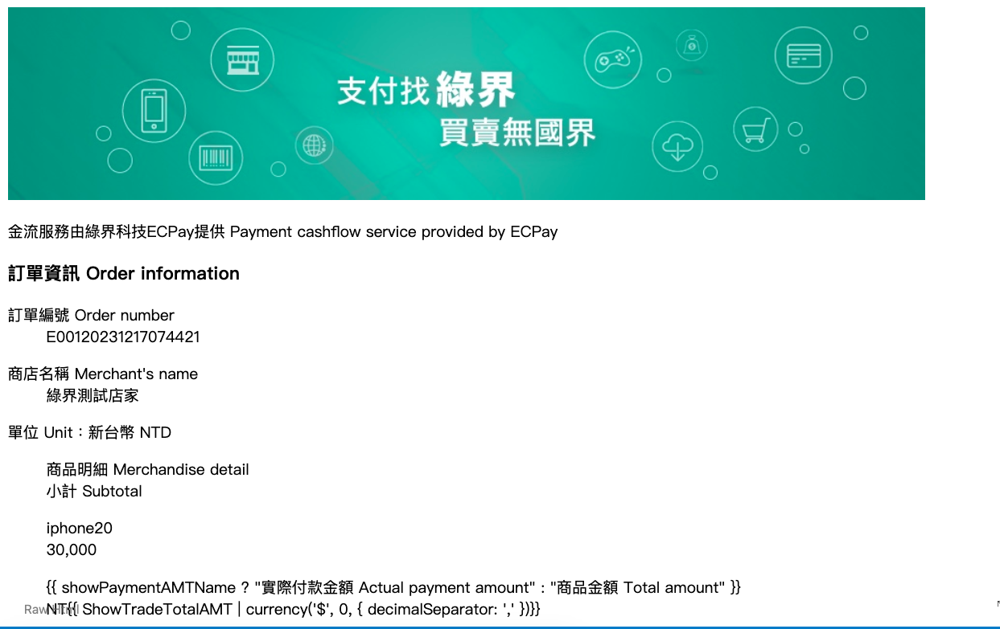
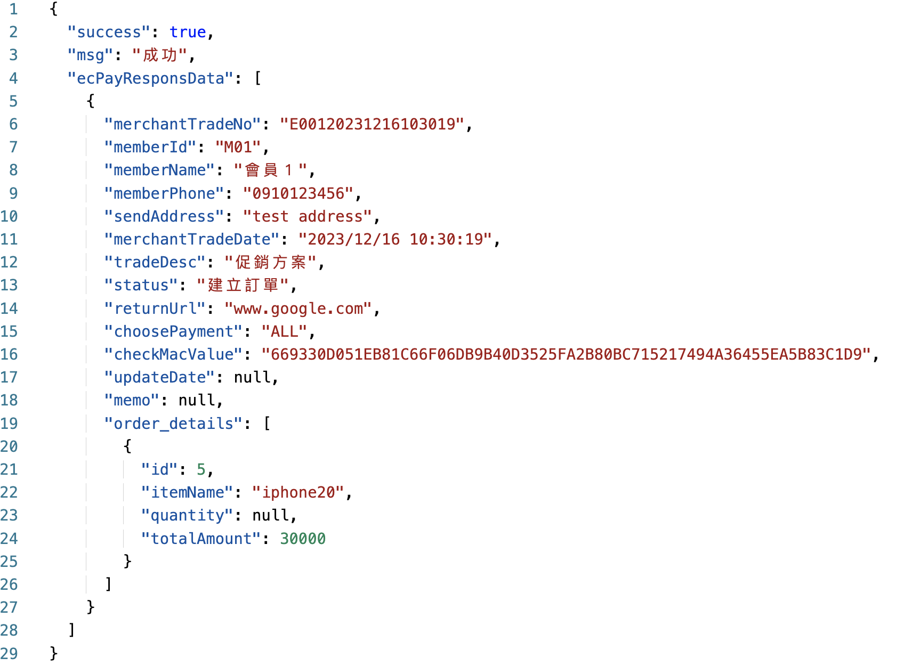

# 串接綠界科技ECPay


## 安裝環境
下載 `main` 分支後切換到目錄，執行
```bash
$ npm install
```
## 本地伺服器
```bash
$ npm start
```


## 測試
- 建立訂單
```json
{
  "ItemName": "APPLE IPHONE 15"
  "tradeDesc" : "促銷方案", 
  "itemName" :   "iphone20",
  "totalAmount" : "30000" ,
  "returnUrl"	: "www.google.com",
  "memberId" :   "M01",
  "memberName" : "會員１",
  "memberPhone" : "0910123456",
  "sendAddress" : "寄送地址"
}
```
<p align="center">
  
</p>


- 查詢訂單
```json
{
"merchantTradeNo": "E00120231216103019",
"memberId": "M01"
}
```

<p align="center">
  
</p>
